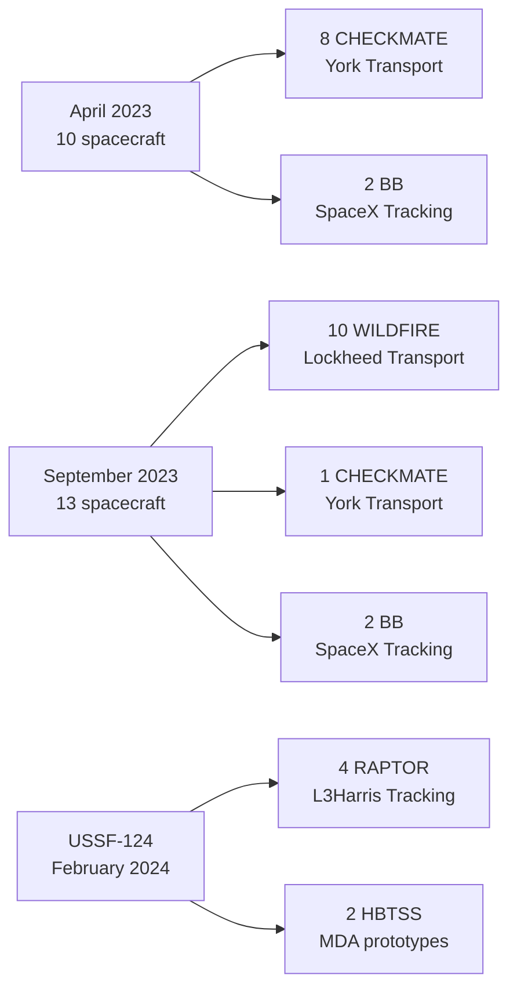
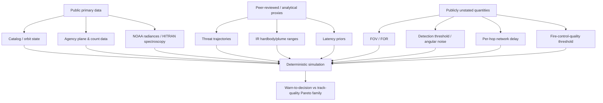

# Public-Source Data Foundation for a Multi-Orbit Missile-Warning and Tracking Feasibility Study

## Executive summary

**ASSUMPTION —** I treat the attached “Deep-research brief 01 — Data foundation” as the governing research topic. The topic is therefore *not* actually unspecified: it is a public-source data-foundation audit for the proposed DAF26BX06-NV510 Phase I study, with the immediate blocker being reliable object-to-mission identification for SDA Tranche 0 and HBTSS. The brief's stated orbital measurements, hypotheses, proposal context, and public-domain-only boundary are taken as inputs rather than independently established facts. fileciteturn0file0

**PUBLISHED —** The most important result is that SDA's own launch manifests resolve most of the apparent catalog mystery. The April 2023 Tranche 0 launch carried **eight York Space Systems Transport Layer satellites and two SpaceX Tracking Layer satellites**; the September 2023 launch carried **ten Lockheed Martin Transport satellites, one York Transport satellite, and two SpaceX Tracking satellites**; and the February 2024 USSF-124 launch carried the **remaining four L3Harris Tranche 0 Tracking satellites alongside two MDA HBTSS prototypes**. SDA separately says the completed Tranche 0 architecture comprised eight Tracking satellites, while only **19 of 20 Transport satellites were put in orbit because one remained on the ground as a testbed**. citeturn0search2turn0search0turn0search3turn0search7

**INFERRED —** Reconciling those official manifests with the public catalog names in the brief gives a very high-confidence mapping: **CHECKMATE = York Transport; WILDFIRE = Lockheed Martin Transport; BB1–4 = SpaceX Tracking; RAPTOR1–4 = L3Harris Tracking.** That means the eight Tranche 0 Tracking objects are NORAD **56170, 56171, 57757, 57760, 58956, 58957, 58958, and 58959**. This is stronger than the prior document's mapping because it follows directly from the exact contractor counts on each launch, but it is still an inference: I found **no SDA/USSF primary-source table explicitly joining every NORAD catalog number to contractor and PWSA layer**. fileciteturn0file0 citeturn0search2turn0search0turn2search0

**PUBLISHED/INFERRED —** This also explains the user's “9 CHECKMATE + 10 WILDFIRE ≈ 20 Transport” puzzle exactly: those are **19 on-orbit Transport spacecraft**, not approximately 20; the twentieth York Transport vehicle is SDA's ground testbed. Hypothesis A is therefore strongly supported, Hypothesis B is effectively refuted, and Hypothesis C is only partly right: the old document was too confident about some orbital assumptions, but its identification of the BB spacecraft as SpaceX Tranche 0 Tracking appears correct. citeturn0search7turn0search2turn0search0

**PUBLISHED —** SDA's current public wording does **not** say every Tranche 0 Tracking satellite flies at 1,000 km and 80°. It says the **majority of Tranche 0 space vehicles** are distributed in two orbital planes at about 1,000 km and 80° inclination. The brief's propagated public elements place the four RAPTOR spacecraft near 40° inclination, so “Tranche 0 Tracking = 1,000 km/80°” should be deleted from the proposal. The public record does not explain why the final four Tracking satellites use the lower-inclination geometry. fileciteturn0file0 citeturn0search1

**UNKNOWN/CLASSIFIED —** Exact field of view/field of regard, quantitative “fire-control-quality” track thresholds, operational end-to-end warning latency, per-hop Transport Layer latency, production OPIR processor/power budgets, and most exact Walker phasing parameters remain publicly unstated. Those are precisely the quantities the proposed study should turn into **swept parameters**, not invented source values. SDA and MDA publicly use terms such as wide-field-of-view, missile-defense/fire-control-quality, low latency, optical links, and on-orbit fusion, but the agency material located here does not attach the numerical thresholds needed to turn those terms into deterministic simulation constants. citeturn11search0turn11search7turn11search9turn11search11turn2search9

**PUBLISHED —** There is nonetheless a solid public architecture baseline. Tranche 1 Tracking is **28 satellites in four highly inclined planes, seven per plane**. Tranche 2 Tracking is approximately **54 satellites in six planes**, with 48 wide-field missile-warning/tracking spacecraft and six missile-defense-oriented spacecraft distributed among L3Harris, Lockheed Martin, and Sierra Space. SSC's MEO Epoch 1 architecture is publicly described as **12 satellites in two MEO planes**; Epoch 2 adds **10 satellites**, and its design review covers two additional orbital planes. Exact MEO altitude and inclination are not stated in the SSC material found. citeturn5search0turn5search2turn5search1turn5search5turn6search0turn6search1turn6search2

**PUBLISHED/REPORTED —** For HBTSS, MDA publicly awarded Phase IIb prototypes to L3Harris and Northrop Grumman. L3Harris subsequently stated that its prototype successfully demonstrated fire-control-quality tracking against a live hypersonic target and that it was the one that uniquely met the required latency/track-quality performance. I found **no equally explicit MDA public source establishing the comparative statement that the Northrop prototype “failed requirements.”** Consequently, that claim should not appear as government-confirmed fact. citeturn2search9turn16search0

**INFERRED —** The best Phase I data policy is therefore to divide every input into three categories: **directly sourced constants**, **public analytical proxies**, and **swept unknowns**. That approach is much more defensible before MITRE/Aerospace reviewers than converting plausible but unsupported architecture lore into “ground truth.”

| Blocking issue | Finding as of 2026-09-23 | Proposal treatment |
|---|---|---|
| A1–A4 catalog identity | **INFERRED — essentially closed.** BB1–4 are SpaceX Tracking; RAPTOR1–4 are L3Harris Tracking; CHECKMATE/WILDFIRE are Transport. Official manifest counts support the mapping. citeturn0search2turn0search0turn2search0 | Freeze these eight Tracking IDs, but mark the NORAD-to-layer join as an inference rather than an SDA-published lookup table. |
| A5 BB health/disposal | **UNKNOWN.** Their public-element evolution is observable; mission-operational/disposal status is not publicly established. fileciteturn0file0 | Model current geometry from elements; do not call the lowering “disposal” without an agency source. |
| A6 HBTSS identity/performance | **Partly closed.** L3Harris vs Northrop prototype program roles are public; exact NORAD-to-contractor mapping is supported by public catalog material but not by an MDA NORAD table; orbit/performance causality is unknown. citeturn2search9turn16search0 | Never infer sensor failure from orbit altitude. |
| B1/B2 constellation geometry | **Partly closed.** Plane/count data are public; many exact altitude/inclination/phasing values are not. citeturn5search0turn5search5turn6search1turn6search2 | Use official plane/count facts and sweep unstated geometry. |
| B3/C4 sensor/track thresholds | **UNKNOWN/CLASSIFIED or publicly unstated.** citeturn11search11turn2search9 | Parameter sweeps. |
| C1/C2 latency | **No authoritative operational end-to-end value found.** Public estimates exist; official material is mainly qualitative. citeturn13search6turn13search9turn11search9 | Treat published estimates as priors/sensitivity cases, not validation truth. |
| D/F open modeling data | **Strong public foundation exists** for trajectories and GOES radiance backgrounds; labeled operational OPIR detection data remain unlocated. citeturn21search1turn21search6turn23search1turn23search5 | Suitable for reproducible Phase I surrogate experiments. |
| J1 prior-document audit | **Several claims require correction.** Most importantly: the on-orbit Transport count, blanket 1,000-km/80° Tracking assertion, interpretation of catalog derivative terms, and “chiefly NRO” withholding claim. | Correct before any simulation or proposal prose is frozen. |

## Catalog identity and orbit architecture

### Tranche 0 manifest and object mapping

**PUBLISHED — A1.** SDA says the first Tranche 0 launch, on April 2, 2023, carried ten spacecraft: eight Transport Layer satellites produced by York Space Systems and two Tracking Layer satellites produced by SpaceX. SDA's overall Tranche 0 acquisition comprised 20 Transport vehicles—ten York and ten Lockheed Martin—and eight Tracking vehicles—four SpaceX and four L3Harris. citeturn0search2turn0search5

**PUBLISHED — A1.** SDA says the September 2, 2023 launch carried 13 spacecraft: ten Lockheed Martin Transport Layer satellites, one York Transport satellite, and two SpaceX Tracking satellites. citeturn0search0

**PUBLISHED — A1.** The third/final Tranche 0 launch was **USSF-124 on February 14, 2024**, not 2023. It launched four remaining SDA Tracking Layer satellites plus two MDA HBTSS prototypes. L3Harris independently states that **five L3Harris-built missile-tracking spacecraft** were on that flight: its HBTSS prototype and its four SDA Tranche 0 Tracking spacecraft. citeturn0search3turn2search0

**PUBLISHED — A1 correction.** SDA later clarified that the fielded Tranche 0 constellation has **19 Transport plus eight Tracking spacecraft**, with one additional Transport spacecraft retained on the ground as a testbed. This explains why the catalog contains 19 CHECKMATE/WILDFIRE objects rather than 20. citeturn0search7

**INFERRED — A2/A3/A4.** Joining those exact launch-by-launch contractor counts to the catalog names supplied in the brief yields the following mapping. The reasoning is unusually strong because each launch has a one-to-one count match; nevertheless, SDA itself does not publish this NORAD lookup table. fileciteturn0file0 citeturn0search2turn0search0turn2search0

| Launch / NORAD | Catalog name | Contractor/layer conclusion | Status and reasoning |
|---|---|---|---|
| 2023-050A–H / 56162–56169 | CHECKMATE 8, 5, 4, 6, 7, 2, 1, 3 | York Transport | **INFERRED — very high confidence.** Exactly eight CHECKMATE payloads occur on a launch SDA says contained exactly eight York Transport vehicles. fileciteturn0file0 citeturn0search2 |
| 2023-050J/K / 56170, 56171 | BB2, BB1 | SpaceX Tracking | **INFERRED — very high confidence.** These are the only other two payloads on the launch SDA says contained exactly two SpaceX Tracking vehicles. fileciteturn0file0 citeturn0search2 |
| 2023-133A,C,E,H,J,K,L,M,N plus other WILDFIRE entries | WILDFIRE 1–10 | Lockheed Martin Transport | **INFERRED — very high confidence.** Exactly ten WILDFIRE objects match SDA's ten Lockheed Transport vehicles. fileciteturn0file0 citeturn0search0 |
| 2023-133F / 57762 | CHECKMATE 10 | York Transport | **INFERRED — very high confidence.** The one CHECKMATE object matches the one additional York Transport vehicle. fileciteturn0file0 citeturn0search0 |
| 2023-133B/D / 57757, 57760 | BB4, BB3 | SpaceX Tracking | **INFERRED — very high confidence.** The two BB objects are the two remaining payloads; SDA says exactly two SpaceX Tracking spacecraft flew. fileciteturn0file0 citeturn0search0 |
| 2024-028B–E / 58956–58959 | RAPTOR4, RAPTOR1, RAPTOR3, RAPTOR2 | L3Harris Tracking | **INFERRED/PUBLISHED — very high confidence.** L3Harris says four of its SDA Tracking spacecraft flew on USSF-124; the four RAPTOR objects are the non-HBTSS payloads in the public manifest. fileciteturn0file0 citeturn2search0turn2search5 |

**INFERRED — A4.** On that basis, the eight Tranche 0 Tracking catalog objects to use are:

| Public name | NORAD | COSPAR | Layer / builder |
|---|---:|---|---|
| BB1 | 56171 | 2023-050K | **INFERRED —** Tracking / SpaceX |
| BB2 | 56170 | 2023-050J | **INFERRED —** Tracking / SpaceX |
| BB3 | 57760 | 2023-133D | **INFERRED —** Tracking / SpaceX |
| BB4 | 57757 | 2023-133B | **INFERRED —** Tracking / SpaceX |
| RAPTOR4 | 58956 | 2024-028B | **INFERRED —** Tracking / L3Harris |
| RAPTOR1 | 58957 | 2024-028C | **INFERRED —** Tracking / L3Harris |
| RAPTOR3 | 58958 | 2024-028D | **INFERRED —** Tracking / L3Harris |
| RAPTOR2 | 58959 | 2024-028E | **INFERRED —** Tracking / L3Harris |

**UNKNOWN/CLASSIFIED — A3.** I did **not** find an authoritative SDA, SSC, MDA, or USSPACECOM publication that provides a definitive table of `NORAD → payload name → contractor → PWSA layer` for Tranche 0. Space-Track states that its GP service covers the unclassified public catalog, but that catalog function is not equivalent to an SDA mission-assignment registry. This absence is worth stating explicitly in the proposal's provenance notes. citeturn14search0



**INFERRED — Suggested figure placement.** Put this diagram immediately ahead of the object-registry provenance table in the feasibility study. It makes the inference auditable: a reviewer can see that the mapping is based on exact official contractor counts rather than name resemblance.

### The 80° / 40° issue

**PUBLISHED — B1/A4.** SDA's current Tranche 0 description says a **majority** of its space vehicles are distributed into two orbital planes at approximately 1,000 km and 80° inclination. That wording applies to Tranche 0 generally; it does not say “all Tracking Layer satellites.” citeturn0search1

**INFERRED — A4.** The brief's September 22–23, 2026 propagation places BB1–4 at approximately 81° inclination and the RAPTOR spacecraft at approximately 40°. Because the four RAPTOR objects are strongly identified as the four L3Harris Tranche 0 Tracking payloads, **the Tracking Layer itself spans at least two substantially different inclination groups in the public catalog**. fileciteturn0file0 citeturn2search0

**UNKNOWN/CLASSIFIED — A4.** I found no public SDA explanation of the mission-design rationale for the ~40° L3Harris Tracking orbits. Do not invent one. Plausible benefits such as regional revisit, stereo diversity, demonstration geometry, or launch-sharing constraints are hypotheses, not sourced facts.

### Tranche 0 health, disposal, and HBTSS

**UNKNOWN/CLASSIFIED — A5.** No primary SDA source located in this research states whether BB1–4 remain mission-operational in September 2026, are in a formal disposal phase, have suffered degradation, or have simply undergone planned orbit evolution. Their continued presence in public orbital-element data establishes that the objects remain trackable, not that their payloads remain operational. fileciteturn0file0

**INFERRED — A5/J1.** The brief's finding that BB altitudes have separated materially from their launch-mates is a legitimate trigger for a time-series investigation, but the sentence “high n-dot means the orbit is contracting” is too strong for a government proposal if based on one element epoch. The robust test is to build a multi-epoch time series of semi-major axis, perigee/apogee, and maneuver discontinuities and then distinguish secular decay from commanded orbit changes. The instantaneous catalog derivative should be treated as a diagnostic, not a mission-status label. fileciteturn0file0

**PUBLISHED — A6.** MDA awarded HBTSS Phase IIb prototype work to both L3Harris and Northrop Grumman. citeturn2search9

**PUBLISHED — A6.** L3Harris says its HBTSS Phase IIb prototype successfully operated on orbit, provided fire-control-quality tracking against a live hypersonic target, and informed subsequent operational capability. This is a **contractor primary source**, not an independent government comparative test report. citeturn16search0

**REPORTED/INFERRED — A6.** Public Space-Track-derived catalog material associates **HBTSS-SV1 / NORAD 58960 with L3Harris** and **HBTSS-SV2 / NORAD 58955 with Northrop Grumman**. Because I did not find an MDA release explicitly pairing contractor names with those NORAD numbers, retain the mapping but mark its provenance as public catalog/secondary rather than agency-confirmed. The brief's measured ~558 km versus ~1,001 km orbital difference is real in its supplied element set, but there is **no public evidence found here that the altitude difference was caused by test performance**. fileciteturn0file0

**REPORTED — A6.** The stronger claim that “Northrop's prototype failed requirements while L3Harris's passed” should presently be written as industry/reporting rather than `PUBLISHED`. L3Harris's own 2026 statement establishes success for its spacecraft; it does not by itself establish the precise failure mode or requirement shortfall of the competing prototype. citeturn16search0

### Withheld objects and DSP-23

**PUBLISHED — A7.** Space-Track describes its service as the public/unclassified space catalog and explicitly notes that some objects can have absent or less timely orbital information for national-security reasons, as well as for mundane tracking/data-quality reasons. Therefore “no current GP record” cannot by itself distinguish classification, retirement, sensor coverage, or another catalog condition. citeturn14search0

**UNKNOWN/CLASSIFIED — A7.** There is no authoritative public master list of U.S. missile-warning or intelligence payloads whose elements are intentionally withheld. Consequently, the proposition that the withheld population is “chiefly NRO payloads” is **unsupported as a comprehensive factual statement**. It may be directionally familiar from public satellite-observer practice, but it does not meet this brief's provenance standard.

**PUBLISHED/REPORTED — A8.** DSP-23 was launched in November 2007 as the final DSP spacecraft. Contemporary reporting stated that it malfunctioned and began drifting in 2008; because it is a GEO object, this was not atmospheric decay. Current third-party catalog aggregation still lists NORAD 32287 as an inactive object in orbit. citeturn17search3turn17search0turn17search12

**INFERRED — A8.** CelesTrak returning no current GP for 32287 therefore does **not** support “decayed” or “renumbered.” Treat DSP-23 as a failed/inactive GEO spacecraft whose public GP availability is a separate catalog-access question. Other late-model DSP objects also remain cataloged as physical objects according to public aggregators, although that does not establish that any remain mission-operational. citeturn17search12turn14search0

### Published constellation geometry

| Program | Publicly supportable geometry | What remains unstated |
|---|---|---|
| Tranche 0 | **PUBLISHED —** 28 produced space vehicles: 20 Transport and 8 Tracking; 19 Transport on orbit plus one ground testbed; majority of vehicles in two planes around 1,000 km and 80°. citeturn0search1turn0search7 | **UNKNOWN —** a single exact Walker `T/P/F`; exact plane membership and phasing of all eight Tracking vehicles. |
| Tranche 1 Tracking | **PUBLISHED —** 28 Tracking satellites, four highly inclined planes, seven satellites per plane. citeturn5search0turn5search2 | **UNKNOWN —** exact official altitude, inclination in degrees, and phasing from the SDA sources found. |
| Tranche 2 Tracking | **PUBLISHED —** approximately 54 satellites in six orbital planes; contracts total 18 each to L3Harris, Lockheed Martin, and Sierra Space, including 48 wide-field MW/MT and six missile-defense-oriented sensors. citeturn5search1turn5search5 | **UNKNOWN —** exact altitude, inclination, Walker phasing, and authoritative sensor angular FOR/FOV. |
| SSC MEO Epoch 1 | **PUBLISHED —** 12 initial satellites in two MEO orbital planes. citeturn6search1turn6search2 | **UNKNOWN —** precise altitude, inclination, phasing. |
| SSC MEO Epoch 2 | **PUBLISHED —** 10 satellites; SSC's September 2026 milestone discusses two Epoch 2 orbital planes building on the initial two Epoch 1 planes. citeturn6search0turn6search2 | **UNKNOWN —** exact altitude/inclination/phasing and exact per-plane allocation. |

**INFERRED — B2.** I found no SSC announcement confirming an Epoch 1 MEO launch by September 23, 2026. The latest official material located here is still describing production/design milestones and the two-plane Epoch 1 constellation rather than an on-orbit operational constellation. For a proposal dated now, use **“zero publicly confirmed launches found”**, not an assertion that launch is impossible or cancelled. citeturn6search1turn6search2

## Sensing, latency, and ground architecture

### Field of regard and the CSIS proxy

**UNKNOWN/CLASSIFIED — B3.** SDA publicly distinguishes wide-field-of-view missile warning/tracking sensors from more missile-defense-oriented or medium-field/fire-control sensors, but I found **no agency-published angular FOV/FOR in degrees** for the operational SDA Tracking Layer, HBTSS, or SSC MEO sensors. citeturn11search12turn11search4

**PUBLISHED — B4.** Masao Dahlgren's December 2023 CSIS report *Getting on Track: Space and Airborne Sensors for Hypersonic Missile Defense* is a genuine public analytical study examining space-sensor architecture tradeoffs and explicitly argues for consideration of multiple orbital regimes rather than relying only on proliferated LEO. citeturn7search0turn18search0

**UNKNOWN — B4.** I could **not independently validate from the report text in this research run** the brief's specific assertion that its notional case is exactly “135 satellites at 1,000 km with a 120° field of regard,” nor could I safely extract the report's complete assumption table. The underlying CSIS PDF was too large for the browsing path available here to render for mandatory PDF inspection. Therefore those three figures should remain **UNCONFIRMED**, not silently promoted into the simulation's reference case. The report itself is still a high-priority acquisition item. citeturn7search0turn18search1

**INFERRED — B3/B4.** Once the CSIS parameter table is independently extracted, it should be tagged `PUBLIC ANALYTICAL PROXY`, never `SDA SENSOR SPECIFICATION`. That distinction is important because CSIS's purpose is architectural analysis, not disclosure of classified sensor design.

### Ground segment and downlink nodes

**PUBLISHED — B5.** The legacy SBIRS/DSP primary Mission Control Station is at **Buckley Space Force Base, Colorado**, with the consolidated backup formerly identified at **Schriever AFB/SFB, Colorado**. The Block 10 ground system consolidated operations from legacy sites into those primary/backup locations. citeturn20search4turn20search6

**PUBLISHED — B5.** The current 2d Space Warning Squadron fact sheet says the squadron is responsible for **six ground stations across four countries and three continents**, but does not publicly enumerate all six locations on that page. citeturn20search7turn20search8

**PUBLISHED — B5.** SSC is also fielding Relay Ground Stations intended to interoperate with legacy and next-generation MW/MT satellites and with FORGE; SSC describes their purpose as accelerating and increasing the resilience of real-time satellite-to-ground mission-data flow. citeturn25search14

**INFERRED — B5.** For Phase I, do **not** reconstruct an assumed classified global ground network. Model Buckley/Schriever and any other explicitly published site as named cases, then make “distance/time to usable downlink node” a swept architecture parameter. That preserves the validity of the ground-versus-edge latency comparison even if the real relay-site roster is not public.

### Warning latency

**UNKNOWN/CLASSIFIED — C1.** I found no current U.S. operating-agency source publishing an end-to-end operational `boost ignition → confirmed warning → dissemination → decision` latency budget for SBIRS/Next-Gen OPIR/PWSA. A single deterministic “government latency” would therefore be false precision.

**REPORTED — C1.** The approximately **30-second** ignition-to-detection/report figure cited in the brief can be traced to a 2025 INSS analytical discussion, not to a USSF performance specification. Older public analysis has also used roughly **60–70 seconds from ignition to alert**, including about 30 seconds after initial DSP detection. These are defensible sensitivity anchors, not operational truth data. citeturn13search6turn13search9

**UNKNOWN — C1.** The brief's attributed National Academies phrase “on the order of one minute to detect and characterize” was not independently recovered here, so do not quote it until the exact report/page is in the data inventory.

**INFERRED — C1.** A better Phase I latency model is additive:

\[
T_{\text{warn→decision}}
=
T_{\text{detect}}
+T_{\text{local processing}}
+T_{\text{network}}
+T_{\text{fusion}}
+T_{\text{dissemination}}
+T_{\text{decision}}
\]

**INFERRED — C1.** Only terms with an authoritative public measurement should be fixed. All others should be distributions or sweeps. This makes the Pareto frontier a result of assumptions that reviewers can perturb rather than a result dependent on one unverifiable “30 s” constant.

### Transport-layer communications and edge processing

**PUBLISHED — C2.** SDA states that its optical inter-satellite links are intended to provide high-rate, low-latency connectivity; Tranche 0 demonstrated optical networking and later demonstrated tactical Link 16 connectivity. Current PWSA descriptions also specify optical links among satellites and satellite-to-ground connectivity. citeturn11search9turn0search1

**UNKNOWN/CLASSIFIED — C2.** I found no SDA primary source in this research that gives a reusable **per-hop optical-link latency**, queueing delay, or end-to-end PWSA propagation-time number suitable for your simulator. Similarly, the public material found does not provide a complete operational Link 16 injection latency budget.

**PUBLISHED — C3.** The POET experiment is strong public evidence that “edge fusion” is not science fiction: SDA described POET as an on-orbit data-fusion experiment and identifies a **CFC-400 processor** running a Custody data-fusion application under spacecraft size, weight, and power constraints. SDA's Custody architecture also publicly discusses automated processing and on-orbit fusion. citeturn11search0turn11search7turn11search11

**INFERRED — C3.** POET supports the **architectural feasibility** of an on-orbit fusion case; it does **not** prove that production Tranche 0/1 Tracking satellites expose the same processor, compute budget, memory, power, or algorithm-hosting environment. Your edge-fusion compute cost should therefore be swept as a resource envelope rather than tied to CFC-400 benchmark performance.

**PUBLISHED/UNKNOWN — C4.** MDA and SDA publicly use “fire-control-quality” or equivalent “weapons-quality” track terminology for HBTSS and missile-defense Tracking sensors, but the public sources located here do not specify a numerical position error, velocity error, covariance, update rate, or handoff threshold that constitutes that quality. citeturn2search9turn11search11

**UNKNOWN/CLASSIFIED — C4.** Treat the numerical fire-control-quality boundary as a classified-or-unpublished requirement and sweep it. In the proposal, define your *simulation metric* explicitly—e.g., 3-D position error/covariance plus continuity and update age—without claiming it equals the classified engagement requirement.

## Threat, infrared, imagery, and tracking evidence

### Open trajectory literature

**PUBLISHED — D1/D2.** Tracy and Wright's *Modelling the Performance of Hypersonic Boost-Glide Missiles*, *Science & Global Security* 28(3), 2020, pp. 135–170, is real, peer reviewed, and openly available through the journal's archive. The paper develops a computational boost-glide trajectory model specifically to support quantitative open-source analysis. citeturn21search1turn21search3

Verified entry point:

`https://scienceandglobalsecurity.org/archive/2020/12/modelling_the_performance.html`

**PUBLISHED — D1.** James Acton's *Hypersonic Boost-Glide Weapons*, *Science & Global Security* 23(3), 2015, is part of the same core literature and is explicitly cited by Berkeley's current simulator documentation together with Tracy and Wright and later Wright/Tracy work. citeturn21search6

**PUBLISHED — D1/E2.** Candler and Leyva's later CFD work on the infrared emission of a generic HGV generated a published technical exchange with Tracy and Wright. The response states that Candler/Leyva calculated lower glide-phase IR emissions than Tracy/Wright's original estimate, while still estimating values above the minimum detection threshold assumed for modern U.S. space sensors. This is exactly the kind of disagreement that should become a sensitivity range rather than a selected “truth.” citeturn21search8

**PUBLISHED — D3.** Berkeley's Risk and Security Lab launched an updated **Hypersonic Glide Vehicle Simulator** and user manual in 2026. BRSL says the application is based on Tracy/Wright's computational models and is designed for approximate, transparent analysis of trajectories, maneuver footprints, and maneuver/range penalties rather than precision engineering prediction. citeturn21search0turn21search4turn21search6

Verified public resources:

`https://hypersonic-missile-flight-model.onrender.com/`

`https://brsl.berkeley.edu/research/publication/quantification-of-hypersonic-missile-capabilities-using-the-hypersonic-glide-vehicle-simulator-a-user-manual/`

`https://escholarship.org/uc/item/75q0m53t`

**INFERRED — D2/D3.** For validation, the Berkeley simulator is now a better independent reference oracle than hand-copying individual plots from the 2020 article because it is maintained by the same modeling lineage and has an explicit 2026 user manual. It should still be treated as an independent *open analytical implementation*, not ground truth. citeturn21search4turn21search6

**UNKNOWN — D2.** I have **not reproduced the full equations-and-every-parameter transcription requested in D2 here**, because I could not inspect the complete journal PDF page-by-page under the required PDF-validation workflow. Do not let a secondary paraphrase become your implementation specification. Acquire the free primary PDF and transcribe equations, atmospheric model, aerodynamic coefficient definitions, initial conditions, numerical integrator, and every table entry into a machine-readable provenance file before coding.

### Depressed-trajectory benchmark

**REPORTED/PUBLISHED-PAPER — D4.** A searchable copy of Gronlund and Wright's *Depressed Trajectory SLBMs: A Technical Evaluation and Arms Control Possibilities* exposes the following Table 1 values. Because the accessible extraction came through a secondary host of the peer-reviewed paper rather than a first-party journal rendering, these should be cross-checked against the original before becoming validation vectors. citeturn21search10

| Range / trajectory | Burnout velocity km/s | Apogee km | Flight time min | R dispersion m | Cross-range dispersion m |
|---|---:|---:|---:|---:|---:|
| 7,400-km MET | 6.3 | 1,340 | 29.2 | 134 | 86 |
| 1,850-km DT-60 SYM | 6.5 | 60 | 7.1 | 4,800–7,400 | 510–1,000 |
| 1,850-km DT-90 | 6.3 | 90 | 7.1 | 2,000–4,000 | 390–730 |
| 1,850-km DT-120 | 6.0 | 120 | 7.2 | 1,300–2,400 | 300–520 |
| 1,850-km DT-150 | 5.6 | 150 | 7.4 | 770–1,300 | 230–350 |
| 3,000-km DT-95 SYM | 6.6 | 95 | 9.8 | 2,600–5,400 | 420–860 |
| 3,000-km DT-135 | 6.3 | 135 | 10.1 | 1,400–2,600 | 320–550 |
| 3,000-km DT-155 | 6.2 | 155 | 10.1 | 1,100–2,000 | 270–460 |
| 3,000-km DT-185 | 5.9 | 185 | 10.4 | 730–1,200 | 220–340 |

**INFERRED — D6.** Do not create one allegedly “typical SRBM/MRBM/ICBM/HGV” trajectory. For detection/tracking analysis, a stronger experimental design is a set of **public-paper validation cases plus bounded class sweeps** over range, burn duration, boost endpoint, apogee/glide altitude, and maneuver profile. This avoids turning an arbitrary representative missile into hidden truth.

**UNKNOWN — D1/D5.** The requested Wright *S&GS* 23, Fetter primer, Wilkening 2004 article, and complete open-source-license survey were not all independently resolved in this run. Likewise, BRSL's public simulator availability does not by itself establish a commercialization-compatible source-code license. **Do not copy or incorporate code until a repository license is explicitly verified.**

### Infrared signature and atmospheric modeling

**PUBLISHED — E2.** The Candler/Leyva–Tracy/Wright literature establishes an important public fact for the Phase I methodology: glide-phase hardbody IR phenomenology can be modeled openly, but even peer-reviewed analyses disagree materially on emission estimates. That is a strong argument for parameterized radiance rather than a single “HGV signature.” citeturn21search8

**UNKNOWN — E1.** The brief's specific ONERA values—MWIR 491–593 W/sr, SWIR 987–1518 W/sr, LWIR 96–103 W/sr—and the cited approximately 1,500 K DLR launch-plume temperature were **not independently verified here**. Keep them quarantined from the baseline until the original experiments, geometry, spectral integration bands, plume scale, viewing angle, and units are captured. fileciteturn0file0

**INFERRED — E1/E2.** Bench-scale radiant intensity is particularly unsafe to scale directly into full-scale missile detection because plume volume, species concentrations, optical thickness, geometry, atmosphere, and sensor bandpass all matter. In the data inventory, preserve *radiance/radiant-intensity provenance and measurement geometry*, not just a single number.

**PUBLISHED — E4.** HITRAN is a maintained spectroscopic database used to model atmospheric transmission and emission. Its official HAPI Python interface supports line-by-line data acquisition and spectral calculation; HAPI is distributed under the **MIT License**, and an API key is free but required for downloading HITRAN data. citeturn23search0turn23search8

**INFERRED — E4.** HAPI/HITRAN is therefore a strong permissive foundation for the Phase I atmospheric-transmission layer when the requirement is a reproducible open model rather than MODTRAN equivalence. It should be validated over the relevant line-of-sight temperature/pressure profiles and sensor bandpasses before use.

### GOES background imagery and launch data

**PUBLISHED — F1.** NOAA's ABI Level-1b product contains calibrated, geolocated top-of-atmosphere radiances for 16 spectral bands. Bands 7–16 are emissive infrared channels; **Band 7 is centered at approximately 3.90 µm**, while Bands 13, 14, and 15 are centered at approximately 10.33, 11.21, and 12.29 µm respectively. citeturn23search2turn23search3

**PUBLISHED — F1.** NOAA currently distributes GOES-16, GOES-18, and GOES-19 data through its Open Data/AWS infrastructure; GOES-17 was moved into storage and ceased its former operational GOES-West feed. NOAA says ABI products have an average temporal frequency of approximately five minutes, with specialized mesoscale sectors also present in the product structure. citeturn23search5turn23search9

**PUBLISHED — F1.** The current AWS/Open Data family uses satellite-specific public buckets, conventionally including:

```text
s3://noaa-goes16/
s3://noaa-goes18/
s3://noaa-goes19/
```

The operational ABI Level-1b product is organized under product keys such as `ABI-L1b-RadF`, `ABI-L1b-RadC`, and mesoscale variants, with files encoded as NetCDF products by channel/time. NOAA's registry and NCEI collection pages are the authoritative access points. citeturn23search1turn23search5turn23search9

**INFERRED — F1/E5.** GOES Band 7 is an especially useful *public background-surrogate channel* for an MWIR detection experiment because it measures real Earth/cloud radiance near 3.9 µm. It is not a proxy for an SDA sensor's sensitivity, point-spread function, scanning law, noise floor, or viewing geometry; those should be separately parameterized. citeturn23search2turn23search3

**UNKNOWN — F2.** I found **no public, labeled corpus of detections produced by operational U.S. space-based missile-warning sensors**. Absence is hard to prove, so the proposal should say **“no public labeled OPIR launch-detection dataset identified in our survey”**, not “none exists.” That formulation is both accurate and auditable.

**UNKNOWN — F3.** I did not recover a reproducible CU Boulder/Project Apollo package containing source code, trained models, and labeled GOES-16 launch data in this research. The brief's AMOS reference therefore remains a specific acquisition task rather than a closed source. fileciteturn0file0

**INFERRED — F4.** The safest truth-set design is to separate the two datasets: use authoritative public launch-event metadata—time, pad/location, vehicle—from range/agency/provider records, then independently query GOES imagery around those times. That prevents a detection algorithm from being “validated” against labels derived from the imagery it is supposed to detect.

### Tracking algorithms and ML ceiling

**UNKNOWN — G2.** I found no canonical Stone Soup publication establishing fixed benchmark scores for IMM, JPDA, and MHT that could serve as a universal regression oracle. Stone Soup remains useful as a reference implementation framework, but example output should not be cited as algorithmic ground truth without a documented scenario and seed.

**INFERRED — G3.** There is no universal “minimum stereo convergence angle” for a usable three-dimensional range fix. In first-order triangulation, range uncertainty becomes badly conditioned as convergence angle \(\alpha\) approaches zero; a useful approximation is that geometric dilution grows roughly with \(1/\sin\alpha\). Therefore the correct simulation input is not “stereo works above X degrees,” but:

\[
\alpha_{\min}
=
\text{the angle at which the assumed angular noise and range produce the chosen 3-D error threshold}.
\]

**INFERRED — G3.** This is advantageous for your Pareto study: sweep bearing error and convergence angle, propagate the resulting covariance, and define “custody” or “fire-control-proxy quality” from the output covariance. That exposes the geometry rather than hiding it behind an arbitrary degree threshold.

**PUBLISHED — G4.** Recent learned/hybrid tracking work does show improvements over classical baselines under particular simulated conditions. A 2026 Bi-LSTM maneuver-switching study reports lower mean position error than IMM in its strong-maneuver scenarios, while a July 2026 preprint, IMMNet, explicitly combines IMM's Bayesian structure with learned components and reports gains across its test scenarios. citeturn24search0turn24academia48

**PUBLISHED — G4.** Learned data association is also an active line of work: RL-JPDA has demonstrated lower simulated RMS error than conventional JPDA in cluttered multi-target examples, and newer transformer/data-association models report gains against conventional association/filtering baselines. citeturn24search5turn24search4

**INFERRED — G4.** The honest Phase I ML claim should therefore be **“learned components may improve model switching or association under maneuver/model mismatch; the study identifies the regions where such improvement can alter mission-level latency/continuity.”** The public papers above do **not** establish that an ML tracker generally beats IMM/JPDA for OPIR missile tracks; their sensor models, training distributions, and maneuver regimes differ from this mission. citeturn24search0turn24academia48turn24search5

**UNKNOWN — G1.** I did not recover a sufficiently authoritative current OpenSky commercial-use terms page to answer the for-profit REST/Trino/curated-dataset licensing question to the standard required for a government proposal. Do not ingest OpenSky into a commercial SBIR data pipeline until its current commercial and redistribution permissions are captured in writing.

## Program, transition, and proposal context

### OPIR Tap Lab and transition environment

**PUBLISHED — H2.** The **OPIR TAP Lab** is in Boulder and describes itself as an environment for third-party developers, universities, and research organizations to build and demonstrate remote-sensing applications, with access to satellite data, annual BAA opportunities, demonstration/industry events, and computing infrastructure spanning multiple classification levels. citeturn25search3turn25search10

**PUBLISHED — H2/H3.** The Tap Lab's current public site states that its familiarization events occur on the third Thursday of the first month of each quarter and **require a Secret clearance**. The site separately describes an “open and inclusive” developer model, but that does not establish that uncleared personnel can receive access to classified mission data or attend the cleared familiarization event. citeturn25search10

**UNKNOWN — H3.** I found no public documentation establishing a standard path by which an entirely uncleared small business with no facility clearance is automatically onboarded into the classified OPIR Tap Lab, nor a verified public list of analogous uncleared firms that have done so.

**INFERRED — H3.** Proposal language should therefore distinguish three stages: an **unclassified Phase I public-data feasibility study**, an **award/transition-driven security onboarding path if government access is later required**, and eventual evaluation against government data in an appropriately accredited environment. Do not imply current access to Tap Lab data or facilities that the company does not possess.

**PUBLISHED — H2.** The Boulder OPIR TAP Lab should remain explicitly separate from SDA's own experimentation/Tap-Lab activities associated with the PWSA. The Boulder site's stated mission is remote-sensing/OPIR application development. citeturn25search10

**UNKNOWN — H1.** I did not find a sufficiently specific current SSC primary source defining **Space Modernization Initiative (SMI)** as an end-to-end transition process for this particular SBIR topic. The solicitation's use of SMI should therefore be treated as the controlling program statement; do not embellish it with an invented formal stage-gate process unless the topic manager/SSC publishes one.

### Next-Gen OPIR, FORGE, and existing solutions

**PUBLISHED — H4.** SSC's public architecture describes Next-Gen OPIR as the successor to SBIRS and historically planned three GEO spacecraft and two polar systems, with FORGE as the modular/open ground framework able to process legacy SBIRS and next-generation OPIR data. The old published “begin launching in 2025” schedule is plainly a historical plan and should not be repeated as a current milestone without newer confirmation. citeturn25search9

**PUBLISHED — H4/H5.** FORGE is no longer merely a future concept. SSC announced a **second operational acceptance in September 2025**, delivering new OPIR processing capability to Space Operations Command and the OPIR Battlespace Awareness Center at Buckley. citeturn25search12

**PUBLISHED — H4/H5.** In March 2025 SSC awarded BAE Systems a **$151 million Phase II FORGE Command-and-Control prototype** effort intended to produce a C2 prototype ready for Next-Gen OPIR. citeturn25search2

**PUBLISHED — H5.** Lockheed Martin was the legacy SBIRS prime and ground-system developer, with Northrop Grumman responsible for the IR payload; BAE is now a confirmed FORGE C2 incumbent. These facts alone are enough to prevent a Phase I proposal from claiming novelty merely for “fusing OPIR data on the ground” or “building resilient OPIR command and control.” citeturn20search2turn25search2

**INFERRED — H5.** The defensible novelty claim is narrower: **an open, reproducible trade-space method for quantifying when fusion placement and AI/ML materially alter mission-level warn-to-decision time and track continuity relative to deterministic classical baselines.** That is different from claiming invention of on-orbit fusion, OPIR data fusion, or resilient ground processing, all of which are already represented in public DoD programs. citeturn11search7turn11search11turn25search12

**PUBLISHED — H4.** Golden Dome is already influencing SDA procurement. In July 2026 SDA announced an Accelerated Missile Defense Tranche 3 architecture with **36 satellites in four orbital planes**, split between missile-warning/tracking and missile-defense variants and designed in part to support global stereo coverage/access. citeturn11search13

**INFERRED — H4.** That procurement strengthens the proposal narrative: the government is moving toward more proliferated, mixed sensor functions and explicit stereo/fire-control roles, increasing the value of a model that quantifies geometry, latency, and fusion-placement tradeoffs rather than assuming one fixed constellation. citeturn11search13

### Technology readiness and CONOPS evidence

**PUBLISHED — I2.** GAO's Technology Readiness Assessment Guide defines TRA as an evidence-based assessment of technology maturity and organizes good practice into five broad steps: prepare the assessment/team, identify critical technologies, assess them, prepare the report, and use the findings. GAO emphasizes credibility, objectivity, reliability, and usefulness. citeturn25search0turn25search1

**PUBLISHED — I2.** GAO's framework treats a **critical technology** as something whose maturity matters to successful system performance/objectives and requires evidence of what environment and level of integration have actually been demonstrated; a TRL is therefore not justified by a label or planned test. Earlier GAO acquisition work characterizes TRL 6 around prototype demonstration in a relevant environment and TRL 7 around prototype demonstration in a realistic/operationally representative environment, while noting special historical treatment for difficult-to-demonstrate space technologies. citeturn25search6turn25search7

**INFERRED — I2.** For this Phase I, likely CTE candidates should be phrased as **technical hypotheses**, not whole products: reproducible multi-orbit coverage/event simulation; latency/fusion-placement modeling; observable-to-track estimation under sparse angular measurements; and reproducible public-data sensor/background surrogates. Each TRL claim should point to a test artifact, scenario, baseline, metric, and repeatable result.

**UNKNOWN — I1.** I did not independently retrieve the official DoDAF 2.02 source in this research pass to the primary-source standard required by the brief, so I would not freeze AV-1/OV-1/OV-2/OV-5b/OV-6c/SV-1 definitions from memory into the proposal data inventory.

**INFERRED — I1.** At proposal-design level, the useful division is nevertheless clear: the **OV-1 should communicate mission actors, threats, sensing/fusion pathways, and operational outcome in one picture**, while detailed node exchanges, activity flows, event timing, and system interfaces belong in the more specialized views. Before delivery, map each view against the official DoDAF 2.02 descriptions rather than an online template.

**UNKNOWN — I3.** I found no authoritative public corpus of successful SpaceWERX Phase I feasibility-study deliverables and associated CONOPS documents suitable for treating as proposal exemplars. Avoid reverse-engineering structure from uncited contractor marketing decks.

## Audit of prior claims

**INFERRED — J1.** The following corrections should be made **before building any simulation component**. The first four affect geometry or source credibility directly.

| Prior claim/hypothesis | Audit result | Correct treatment |
|---|---|---|
| “Tranche 0 Tracking Layer flies at 1,000 km, 80°.” | **WRONG/OVERBROAD. PUBLISHED —** SDA says the *majority of Tranche 0 vehicles* are in two ~1,000-km, 80° planes. It does not assign that geometry to every Tracking spacecraft. citeturn0search1 | Replace with the exact SDA wording; ingest real public elements for object-level geometry. |
| “9 CHECKMATE + 10 WILDFIRE ≈ 20 Transport.” | **OUTDATED/IMPRECISE. PUBLISHED —** It is exactly the expected **19 on-orbit Transport** spacecraft; one of 20 remains a ground testbed. citeturn0search7 | Treat all 19 CHECKMATE/WILDFIRE as on-orbit Transport. |
| Hypothesis A: BB = SpaceX Tracking; CHECKMATE/WILDFIRE = Transport. | **STRONGLY SUPPORTED. INFERRED —** Exact manifest counts resolve the mapping. citeturn0search2turn0search0 | Adopt, with provenance tag `manifest-count inference`. |
| Hypothesis B: BB may be deployment hardware/debris. | **EFFECTIVELY REFUTED. INFERRED —** The two BB objects on each early launch exactly occupy the two SpaceX Tracking payload slots. citeturn0search2turn0search0 | Remove from active hypotheses. |
| Hypothesis C: prior NORAD mapping simply wrong. | **PARTLY WRONG.** The BB identification appears correct; the blanket orbit interpretation is the larger error. | Preserve IDs, correct provenance and orbital assumptions. |
| “T0 has 20 Transport satellites on orbit.” | **WRONG. PUBLISHED —** 19 on orbit plus one ground testbed. citeturn0search7 | Use 19 for orbital coverage. |
| “High n-dot means the orbit is contracting,” used as disposal evidence. | **UNSUPPORTED AS STATED. INFERRED —** One fitted element derivative is insufficient to determine mission intent. fileciteturn0file0 | Use multi-epoch orbital-element trends and maneuver detection; label disposal only from an agency source. |
| “RAPTOR2 alone is SDA Tracking on USSF-124.” | **WRONG/INCOMPLETE if implied. PUBLISHED/INFERRED —** all four RAPTOR objects correspond to the four L3Harris T0 Tracking payloads. citeturn2search0 | Registry should include RAPTOR1–4. |
| “HBTSS-SV1 is Northrop and SV2 L3Harris.” | **APPEARS REVERSED. REPORTED/INFERRED —** public catalog-derived material associates SV1/58960 with L3Harris and SV2/58955 with Northrop. | Correct, while tagging the exact NORAD-to-contractor join as non-agency catalog provenance. |
| “Northrop HBTSS failed; L3Harris passed.” | **ONLY PARTLY SUPPORTED.** L3Harris publicly documents its own successful prototype; a government comparative failure statement for Northrop was not found. citeturn16search0 | Say “L3Harris reports successful demonstration”; do not state Northrop failed unless a primary test record is acquired. |
| “The 443-km HBTSS orbit difference is related to performance.” | **UNKNOWN.** No causal public source found. | Never use orbit altitude as a proxy for payload test success. |
| “SBIRS, DSP, SDA Tracking, and HBTSS are all published; withheld objects are chiefly NRO.” | **UNSUPPORTED AS A GENERAL RULE. PUBLISHED —** Space-Track confirms the public/unclassified catalog can omit or delay orbital information for security and other reasons, but does not publish a comprehensive mission-by-mission withheld list. citeturn14search0 | Make catalog availability an object-level field, not a mission-class assumption. |
| “DSP-23 returned no GP, therefore perhaps decayed.” | **WRONG AS A DECAY HYPOTHESIS. REPORTED —** DSP-23 failed and drifted in GEO; public catalog aggregators still identify it as an in-orbit inactive object. citeturn17search0turn17search12 | Record `inactive/failed; current GP availability unresolved`. |
| SDA “final launch February 2023.” | **PUBLISHED TYPO/CONFLICT.** SDA's current page contains a date inconsistency; USSF-124 actually launched February 14, 2024. citeturn0search3turn0search1 | Use 2024 and note the source typo if directly quoting the page. |
| Gunter's 950 km / 80–89.5° values as architecture truth | **LOW-PRIORITY SECONDARY SOURCE.** | Do not use when SDA statements and public elements are available. |
| CSIS 135 satellites / 1,000 km / 120° FOR | **UNCONFIRMED IN THIS PASS.** | Do not use until the report's exact table/page is captured. |

**INFERRED — J1.** The most consequential conceptual correction is this: **architecture documents and real catalog geometry answer different questions.** An SDA fact sheet can truthfully describe a nominal or majority architecture while individual demonstrator spacecraft occupy other or decaying orbits. For coverage simulation at a historical/current epoch, propagate the objects. For future architecture trades, use agency-stated design parameters. Never substitute one for the other.

## Data-foundation plan, methods, and next steps

### Source and uncertainty model

**INFERRED — J2.** Every scalar or categorical input should carry a provenance record rather than being stored as a naked value. A minimal schema is:

```text
parameter_id
value / distribution
units
reference frame / time standard
valid_from / valid_to
source_title
source_agency
source_date
source_locator (page/table/section/API query)
status = PUBLISHED | REPORTED | INFERRED | UNKNOWN_CLASSIFIED
confidence
license / redistribution constraints
transformation_from_source
known_failure_modes
consuming_simulation_component
validation_test
```

**INFERRED — J2.** The most important missing data domains in the current brief are not additional satellite names; they are **uncertainty and calibration domains**. In particular, add: historical element epochs and maneuver detection; Earth orientation/time standards; sensor angular/noise surrogate models; occultation/limb geometry; background radiance distributions conditioned on cloud/terrain/view angle; line-of-sight atmospheric profiles; network delay distributions rather than point estimates; clock/time-tag errors; event-label uncertainty; and covariance/track-quality definitions.

**INFERRED — J2.** A useful three-tier source policy is:

| Tier | Allowed use | Examples |
|---|---|---|
| **A — authoritative input** | Fixed baseline constant or categorical assignment | SDA/SSC/MDA/USSF releases; Space-Track public catalog semantics; NOAA Level-1b radiances; GAO guidance. citeturn14search0turn23search1turn25search0 |
| **B — public analytical proxy** | Baseline surrogate plus mandatory sensitivity sweep | Peer-reviewed Tracy/Wright/Candler; CSIS architecture studies; published latency estimates. citeturn21search1turn21search8turn7search0 |
| **C — unresolved/classified** | Sweep only; no sourced “true” value | OPIR FOR/FOV, true detection thresholds, fire-control covariance limits, operational network latency. citeturn11search4turn11search11 |

### Evaluation criteria

**INFERRED —** A source should enter the baseline only if it passes five tests: **provenance**, **semantic fit**, **time validity**, **units/frame completeness**, and **reproducibility**. An official number is still unusable if it describes a future nominal architecture while the simulation claims to reproduce a September 2026 on-orbit state.

**INFERRED —** Each simulation-domain implementation should then have three validation layers:

1. **Component validation:** reproduce published vectors, tables, or radiances.
2. **Cross-implementation validation:** compare against an independent implementation such as the Berkeley glide simulator or a second orbit library.
3. **Mission sensitivity validation:** verify that small changes in unknown inputs move warn time/track continuity in physically intelligible directions rather than exposing numerical artifacts.

**INFERRED —** The headline Pareto frontier should report uncertainty bands. A single curve risks implying knowledge of classified sensor and network constants; a family of Pareto fronts indexed by detection threshold, angular error, FOR, and network delay makes the public-data boundary visible.

### Prioritized closure plan

**INFERRED —** The data-foundation phase can be closed with a short evidence sprint organized around *blocking uncertainty*, not around coding.

| Priority / suggested elapsed time | Work package | Deliverable / exit criterion |
|---|---|---|
| **Immediate — day 1** | Freeze T0 registry | Machine-readable object registry containing all 19 Transport, eight Tracking, and two HBTSS prototypes; every contractor/layer assignment tagged with provenance and confidence. |
| **Immediate — days 1–2** | Historical orbit audit | Multi-epoch plots of altitude, perigee/apogee, inclination, and maneuver discontinuities for BB1–4, RAPTOR1–4, HBTSS-SV1/2. Exit when “current geometry” and “mission status” are no longer conflated. |
| **Blocking — days 2–3** | Architecture parameter ledger | T0/T1/T2/MEO plane counts and all explicitly published geometry, with blank/`UNKNOWN` cells rather than guesses. |
| **Blocking — days 3–4** | Latency ledger | Every public timing figure decomposed into pipeline stages; source quality indicated; simulation distributions specified separately from sourced facts. |
| **High value — days 4–6** | CSIS + trajectory primary-source extraction | Page-level extraction of the Dahlgren assumptions and Tracy/Wright equations/parameters; Gronlund Table 1 independently verified. |
| **High value — days 5–7** | IR/background package | HITRAN/HAPI transmission prototype inputs; GOES ABI Level-1b sample corpus; documented radiance units, channels, calibration and artifact flags. citeturn23search0turn23search3turn23search4 |
| **Before simulation freeze — days 7–9** | Baseline tracker benchmark | Classical IMM/JPDA/MHT scenario definitions with seeds and metrics; ML papers mapped against exactly the same observability/noise assumptions. |
| **Before proposal freeze — days 9–10** | Proposal evidence audit | Every quantitative sentence in CONOPS/technical volume points to the provenance ledger or is explicitly labeled a sensitivity parameter. |

### Recommended simulation parameter hierarchy

**INFERRED —** The simulation should separate **observed present-day geometry**, **published future/reference architecture**, and **notional sensitivity variables**:



**INFERRED — Suggested chart placement.** Place this immediately before the Phase I technical approach. It visually demonstrates a key proposal virtue: classified or unavailable quantities enter as explicit uncertainty dimensions rather than being back-filled from questionable internet estimates.

### Highest-value unresolved research items

**UNKNOWN —** Five issues remain important enough that they should stay visibly open in the data inventory rather than being “answered” through inference:

| Open item | Why it matters |
|---|---|
| **Exact CSIS Dahlgren parameter table** | Best public candidate for a respected notional sensor/FOR architecture; the claimed 135/1,000 km/120° values still need page-level confirmation. citeturn7search0 |
| **Full Tracy/Wright implementation transcription** | Needed to create defensible HGV regression tests rather than merely citing the paper. citeturn21search1 |
| **Authoritative comparative HBTSS test result** | Needed before saying one contractor failed requirements; L3Harris's success is public, the comparative claim is not yet government-confirmed. citeturn16search0 |
| **Current OpenSky commercial licensing** | Legal/data-rights blocker if ADS-B is used in a for-profit validation pipeline. |
| **Project Apollo/CU Boulder reproducibility package** | Could be the best public bridge between GOES radiances and launch-detection experimentation, but no code/data package was verified here. |

**INFERRED —** The final data-foundation exit criterion should be: **nothing consumed by the simulation exists merely because it appeared in a prior research memo.** Every consumed input must be either (a) reproducibly acquired from a documented source, (b) derived from such a source with the transformation recorded, or (c) declared a swept assumption.

**INFERRED —** On that standard, the blocking catalog problem is now substantially solved. The most defensible registry is **19 CHECKMATE/WILDFIRE Transport vehicles; BB1–4 plus RAPTOR1–4 as the eight Tranche 0 Tracking vehicles; HBTSS-SV1/2 treated separately as MDA prototypes**. What remains uncertain is not which objects belong to Tranche 0 so much as **their mission health, exact sensor characteristics, actual processing/network timing, and the operational thresholds that convert a visible target into an actionable track**. Those are precisely the dimensions your proposed deterministic sensitivity study is well suited to expose rather than pretend to know. citeturn0search7turn0search2turn0search0turn2search0